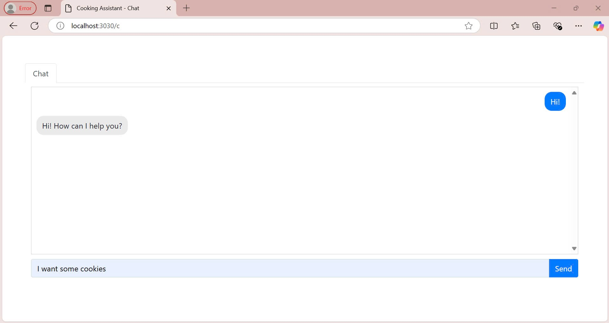
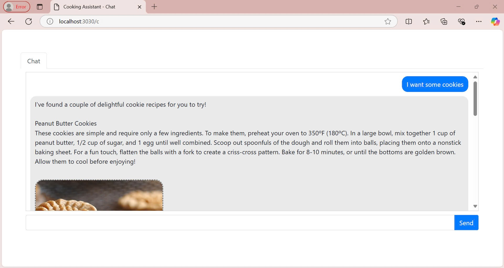
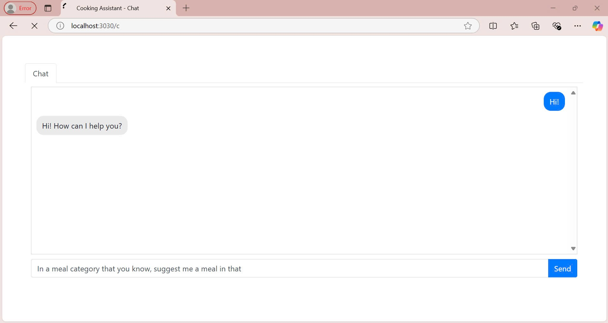

# Cooking Assistant
The goal of this project is to build a culinary helper bot using tool and function calls.  **Cooking Assistant** is an application designed to help users discover recipes based on ingredients they already have. We hope this will help users find creative recipes to try in their kitchen.

# Overview
In this project, we use `node.js` to desmonstrate the output of the LLM, which is an `OpenAI` model, `gpt-4o-mini`.
For the API we used to allow the LLM to search for information about recipes, we can get it at https://www.themealdb.com/api.php. It is a free recipe API support.

# Installation
1. Clone the current repository
   ```
   git clone https://github.com/leonart-delux/cooking-assistant.git 
   ```
2. Enter the project root directory
   ```
   cd cooking-assistant
   ```
3. Set up environment variables
   Add your Open AI API key to environment variables in your root device.
   ```
   OPENAI_API_KEY=your Open AI api key
   ```
4. Run project
   ```
   npm start
   ```
   The server should start running at http://localhost:3030/c

# Tool & function calling
## Introduction

When working with LLMs to develop applications that require specific, reliable data retrieval—such as retrieving recipe information, using **tools and function calling** offers distinct advantages over relying solely on direct LLM responses. 

### 1. Improved accuracy and reliability

LLMs are highly capable at generating natural language responses, but they may not always retrieve precise or up-to-date information, especially when interacting with structured data or APIs. By using tools and function calling:

- **We retrieve exact data** from verified sources and APIs, minimizing the risk of inaccuracies that can arise from general LLM responses.
- **We ensure consistency**, as the model relies on trusted functions or APIs rather than generating answers based solely on training data.

### 2. Better control over data handling

Function calling allows for fine-tuned control over how data is processed and used in the application. With function calling, we can:

- **Specify data formats** directly, ensuring uniformity in responses, which is particularly useful when presenting recipe ingredients, steps, or nutrition data.
- **Implement custom logic** that fits our project requirements, enabling specialized actions such as ingredient substitution, nutrition calculation, or cuisine-based filtering that may not be supported by direct LLM interaction.

### 3. Understanding token usage

Functions are injected into the model’s system message in a syntax the model recognizes, meaning that they count toward the model’s context limit and are billed as input tokens. Using tools & function calling can manage token limits effectively by:

- **Limit the number of functions** or **shorten descriptions** for function parameters if you approach token limits.
- **Consider fine-tuning** if you have a large number of functions, as this can help reduce the token usage associated with your tool specifications.

## How it worked


# Works in our project
## Functions
To support the project, we have created many function in the list below, you can find them in `services\function.js`:

**List of function:**
1. **lookupFullMealDetailsById:**  Return a list of meals but only has 1 element, which has full details of a meal equivalent to provided meal ID
2. **searchMealsByName:** Return list of meals has 'name' in their names, each one has full details 
3. **lookupASingleRandomMeal:** Return a list of meals but only has 1 element, which has full details of a random meal 
4. **listAllMealCategories:** Return a list of all categories, each one has name only 
5. **filterByCategory:** Return a list of meals belong to provided category, each one has: meal name, meal ID, meal thumbnail <br>
6. **listAllAreas:** Return a list contains all areas, each one has only area name <br>
7. **filterByArea:** Return a list contains all meals belong to provided area, each one has: meal name, meal ID, meal thumbnail <br>
8. **filterMealDetails:** Filter important fields of a meal detail <br>

In this session we will pick one to show the detail:
```
lookupFullMealDetailsById(mealID) {
        const url = `https://www.themealdb.com/api/json/v1/1/lookup.php?i=${mealID}`;
        // Fetch data from url
        const response = await fetch(url);
        // Parse data
        const data = await response.json();

        // Error check
        if (!response.ok) {
            throw new Error(data.message);
        }

        return filterMealDetails(data.meals[0]);
    },
```
The `lookupFullMealDetailsById` function is designed to fetch and filter detailed information about a meal from the external API `https://www.themealdb.com/api.php`. The function takes a single parameter, `mealID`, and retrieves detailed meal information such as name, instructions, ingredients, and other related data from the API. 
## Tools
We also made many tools in order to works with these functions:
<details>
  <summary><strong>lookup_full_meal_details_by_id</strong></summary>

  ```json
  {
      "type": "function",
      "function": {
          "name": "lookup_full_meal_details_by_id",
          "description": "Retrieve full details of a meal by its ID, including its name, instructions, image, guide video, ingredients, and equivalent measures.",
          "parameters": {
              "type": "object",
              "properties": {
                  "mealID": {
                      "type": "string",
                      "description": "The unique ID of the meal."
                  }
              },
              "required": ["mealID"],
              "additionalProperties": false
          }
      }
  }
  ```
</details>

<details>
  <summary><strong>search_meals_by_name</strong></summary>

  ```json
  {
      "type": "function",
      "function": {
          "name": "search_meals_by_name",
          "description": "Search for all meals that contain the given name. Each meal contains name, instructions, image, guide video, ingredients, and equivalent measures.",
          "parameters": {
              "type": "object",
              "properties": {
                  "name": {
                      "type": "string",
                      "description": "The name or part of the name of the meal to search for."
                  }
              },
              "required": ["name"],
              "additionalProperties": false
          }
      }
  }
  ```
</details>

<details>
  <summary><strong>lookup_single_random_meal</strong></summary>

  ```json
  {
      "type": "function",
      "function": {
          "name": "lookup_single_random_meal",
          "description": "Retrieve full details of a random meal, including its name, instructions, image, guide video, ingredients, and equivalent measures.",
          "parameters": {
              "type": "object",
              "properties": {},
              "required": [],
              "additionalProperties": false
          }
      }
  }
  ```
</details>

<details>
  <summary><strong>list_all_meal_categories</strong></summary>

  ```json
  {
      "type": "function",
      "function": {
          "name": "list_all_meal_categories",
          "description": "Retrieve a list of all meal categories or kind of foods. This function returns the names of categories.",
          "parameters": {
              "type": "object",
              "properties": {},
              "required": [],
              "additionalProperties": false
          }
      }
  }
  ```
</details>

<details>
  <summary><strong>filter_meals_by_category</strong></summary>

  ```json
  {
      "type": "function",
      "function": {
          "name": "filter_meals_by_category",
          "description": "Retrieve a list of meals that belong to a specific category. Each meal will include its name, ID, and thumbnail image.",
          "parameters": {
              "type": "object",
              "properties": {
                  "category": {
                      "type": "string",
                      "description": "The category of meals to filter by."
                  }
              },
              "required": ["category"],
              "additionalProperties": false
          }
      }
  }
  ```
</details>

<details>
  <summary><strong>list_all_areas</strong></summary>

  ```json
  {
      "type": "function",
      "function": {
          "name": "list_all_areas",
          "description": "Retrieve a list of all areas that you have some cooking knowledges about these areas. Each area contains only its name.",
          "parameters": {
              "type": "object",
              "properties": {},
              "required": [],
              "additionalProperties": false
          }
      }
  }
  ```
</details>

<details>
  <summary><strong>filter_meals_by_area</strong></summary>

  ```json
  {
      "type": "function",
      "function": {
          "name": "filter_meals_by_area",
          "description": "Retrieve a list of meals that belong to a specific area. Each meal will include its name, ID, and thumbnail image.",
          "parameters": {
              "type": "object",
              "properties": {
                  "area": {
                      "type": "string",
                      "description": "The area to filter meals by."
                  }
              },
              "required": ["area"],
              "additionalProperties": false
          }
      }
  }
  ```
</details>


You can explore our prebuild tools in `services\tools.js`. To easy understand, we will get a tool related to function above:
```
    {
        type: "function",
        function: {
            name: "lookup_full_meal_details_by_id",
            description: "Retrieve full details of a meal by its ID, including its name, instructions, image, guide video, ingredients, and equivalent measures.",
            parameters: {
                type: "object",
                properties: {
                    mealID: {
                        type: "string",
                        description: "The unique ID of the meal."
                    }
                },
                required: ["mealID"],
                additionalProperties: false,
            }
        }
    },
```
### 1. **Type Specification**:
To specifies that this is a function call, we use `type: "function"` . In the context of LLMs, when the system sees type `function`, it understands that the request requires executing an external function to complete the task.
### 2. **Details**:
Function Name and Description:
- `name: "lookup_full_meal_details_by_id"`: This is the name of the function defined, used to identify and call. When above tool is use, it will call this function.
- `description`: Provides a description of the function's purpose. In this case, the function is used to retrieve detailed information about a meal via its `mealID`, including the meal name, instructions, image, guide video, ingredients, and equivalent measures.
### 3. **Parameters**:
Parameter Definition:
- In `parameters`, an object `properties` is declared to describe the parameters that the function requires. In thi case, this function requires only one parameter: `mealID`  `string` parameter, representing the unique ID of the meal whose details are being requested.

Required Parameters:
- `required: ["mealID"]`: Ensures that `mealID` is a required parameter when calling this function.

Restriction on Additional Parameters:
- `additionalProperties: false`: This prevents adding any unspecified parameters to the function call.

## Adjust model behavior

We adjusting the behavior of the model allows to customize its responses to better fit specific tasks or user needs. We have to ensure the assistant remains focused on providing relevant meal suggestions, recipes, and cooking tips. It can also guide the assistant to refuse non-cooking-related queries, maintain a friendly and approachable tone, and format its responses in a consistent way, such as embedding images and videos correctly. These adjustments make the assistant more useful and engaging for users, delivering clear and helpful information in the desired style.

## Create chat request
```
// Make a call to LLM
async function createChatRequest(message) {
    try {
        // Loop while still have tool call
        while (true) {

            // Make a call after receive user input or after process called function
            const completion = await openai.chat.completions.create({
                model: "gpt-4o-mini",
                messages: conversationMessages,
                tools: toolNames,
            });

            // Storing result of model to history
            conversationMessages.push(completion.choices[0].message);
            // Tracking conversation on server console
            console.log("\nModel response:\n", completion.choices[0].message);

            // Check for tool call
            if (completion.choices[0].finish_reason === "tool_calls") {

                // For each tool call
                for (const element of completion.choices[0].message.tool_calls) {
                    // Parse agurment and get the function
                    const functionName = element.function.name;
                    const argument = element.function.arguments ? JSON.parse(element.function.arguments) : {};

                    // Track on server
                    console.log(`\nFunction called: ${functionName}\nArguments:${element.function.arguments}`);

                    // Process function
                    const functionResult = await processFunction(functionName, argument);

                    // Pack result into a message
                    const toolResult = {
                        role: "tool",
                        content: JSON.stringify(functionResult),
                        tool_call_id: element.id,
                    };

                    // Save that message to conversation history
                    conversationMessages.push(toolResult);
                    // Tracking conversation on server console
                    console.log("\nResponse to model:\n", toolResult);
                }
            }
            else {
                // No tool is called
                break;
            }
        }

    } catch (error) {
        console.error("\nError fetching response from OpenAI:", error);
    }
}
```

This is an important function, designed to handle a conversation with an AI model. It help us handles continuous conversation by sends a request to the OpenAI API and continues processing external tools (if the model calls for them) until no more tool calls are required. When the model calls for a tool, the function extracts the tool's information, processes it, and returns the result back into the conversation. Also, the model's responses and the tool results are stored in the conversation history to maintain continuity for future interactions.

We use this function to process each case of call:
```
async function processFunction(functionName, argument) {
    switch (functionName) {
        case "list_all_areas":
            return await toolFuctions.listAllAreas();
        case "filter_meals_by_area":
            return await toolFuctions.filterByArea(argument.area);
        case "list_all_meal_categories":
            return await toolFuctions.listAllMealCategories();
        case "filter_meals_by_category":
            return await toolFuctions.filterByCategory(argument.category);
        case "lookup_single_random_meal":
            return await toolFuctions.lookupASingleRandomMeal();
        case "lookup_full_meal_details_by_id":
            return await toolFuctions.lookupFullMealDetailsById(argument.mealID);
        case "search_meals_by_name":
            return await toolFuctions.searchMealsByName(argument.name);
        default:
            throw new Error(`\nUnknown function name: ${functionName}`);
    }
    return {};
}
```
# Demo
## Tool & function call when we want to find specific item
Chat UI

Try to make a simple prompt

Result will be


Let break down how the data is processed, step by step. We have config our code so that in the console it will return all response log:
1. User input & model response


This show us how input data get in the program and how model response to it:

- `role: 'assistant'`: This indicates that the response is from the assistant, meaning this is the result returned by the model.

- `content: null`: This is set to `null`, meaning no text content is returned in this response. This is typical when the system performs an action (such as calling a function) without needing to return immediate textual data.

- `tool_calls`: This section describes the tools that the system called during the request processing. With `id` is a unique identifier for the tool call. `Type` to indicates that the system executed an external function to complete the task. `function` signifies that an object function was called, but the specific details about the function are not provided in this part of the response. 

- `refusal: null`: This is `null`, meaning there is no refusal in the response. It indicates that the request was processed successfully without any errors or refusals.

2. Response to model
   

We can see that `tool_call_id` is exactly the same of the model response. The role value of `'tool'` indicates that this response originates from an external tool or automated system, rather than directly from the user or LLM itself. This role designation shows that the response content has been fetched from a tool, such as an API or another automated system that processes or retrieves the necessary information based on the user's request.

3. Model respone
   

And here is the final output, after interprets the tool's response, the model sends final response back to the users.

## Try chain tools & function calling
Let try with another function, below is we using `list_all_meal_categories`. From that chat UI, do another input:


Tool call 


When model retrive a list of category, another tool call is made to find a list of meal


This is the moment when model have data for meal, now it will made another tool call to fetch that meal detail


And the final result is:


When it come to this step, model will interprets the tool's response like above case and send back to end users.


## Interesting thing happened
Let look closer at this <br>


At first, the model do not know how to process our request. Although the tool call is success but model don't have the answer. So we tell it to try again and then it use another function, result is better.


